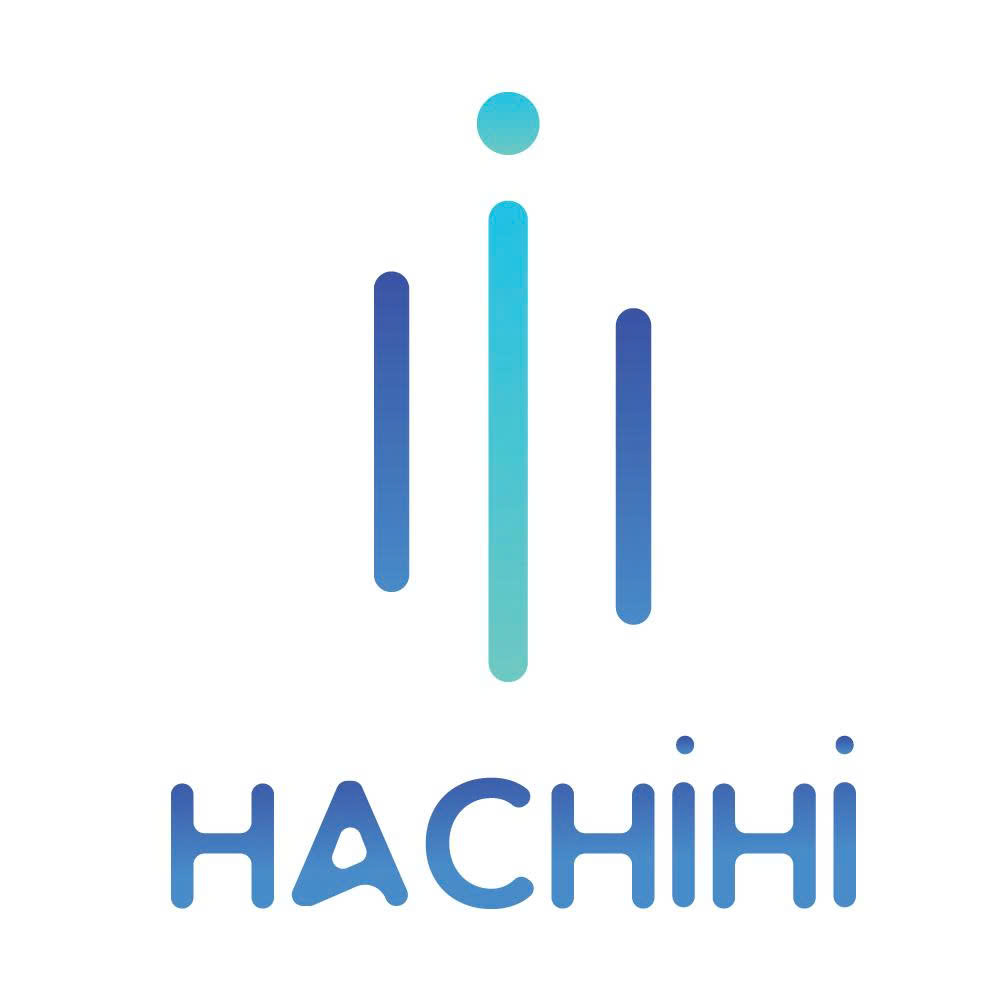

DOANH NGHIỆP CÓ THỂ ĐANG DÙNG WINDOWS & PHẦN MỀM MỖI NGÀY… NHƯNG CHƯA BIẾT MÌNH ĐANG DÙNG ĐÚNG KHÔNG?

Máy tính vẫn chạy.
Windows vẫn báo Activated.
Nhân viên vẫn làm việc bình thường.

Nhưng nếu hôm nay có người hỏi:
“Doanh nghiệp anh/chị đang sử dụng những phần mềm gì? License của từng máy ở đâu? Có đủ hồ sơ chứng minh quyền sử dụng không?”
Anh/chị có chắc mình trả lời được?

Đây là một khoảng trống mà rất nhiều doanh nghiệp đang gặp phải.
Không phải vì doanh nghiệp cố tình sử dụng phần mềm không hợp pháp.
Mà đơn giản là chưa có người giúp kiểm tra, chưa hiểu đúng về các loại license và chưa từng có một lần rà soát tổng thể.

Đáng nói hơn, nhiều doanh nghiệp lại quyết định mua phần mềm dựa trên một tiêu chí duy nhất:
“Bản nào rẻ hơn?”
Trong khi câu hỏi đúng phải là:
“Bản nào phù hợp với doanh nghiệp, có quyền sử dụng rõ ràng và có thể chứng minh được khi cần?”

🎁 HACHIHI TẶNG DOANH NGHIỆP GÓI TẦM SOÁT PHẦN MỀM & THIẾT BỊ
Không bán hàng trước.
Không yêu cầu cam kết mua hàng.
Không cần đầu tư ngay.
Chỉ đơn giản là giúp doanh nghiệp biết hiện trạng của mình trước khi quyết định phải làm gì.

Ứng dụng chạy trên chính máy của doanh nghiệp. 
HACHIHI cam kết không thu thập dữ liệu của doanh nghiệp.
Mục đích duy nhất:
Giúp doanh nghiệp nhìn thấy hiện trạng trước khi quyết định đầu tư.
Nếu doanh nghiệp muốn hiểu sâu hơn, HACHIHI tặng thêm một buổi Meeting Online 30 phút, giúp doanh nghiệp có thể bắt đầu nhìn rõ bức tranh của mình.

HACHIHI - CÔNG TY TNHH CÔNG NGHỆ HOÀNG MAI
📍 Văn phòng: 41 Đường số 6, Khu nhà ở Bắc Đinh Bộ Lĩnh, Phường Bình Thạnh, TP.HCM
📍 Showroom & bảo hành: 51 Đường D5, Phường Thạnh Mỹ Tây, TP.HCM
🌐 Website: hachihi.vn
📞 Tổng đài: 093 384 2126
